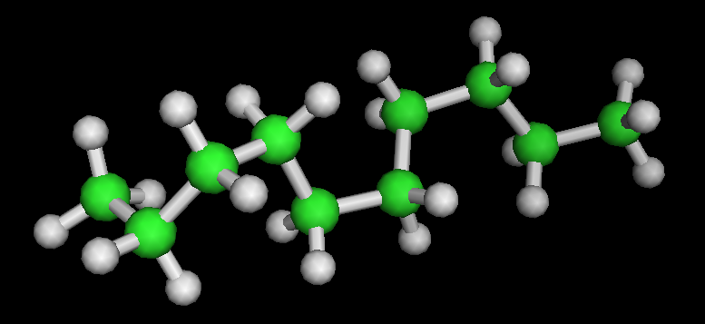

# amoch
AMOrphous CHain builder: create atomistic polymer chain structures

This simulator generates atomistic structures of amorphous systems using the
continuous configurational bias Monte Carlo (CCBMC) method for adjusting torsion
angles along the backbone of chain molecules while packing them into a cell.  
AMOCH is an improved version of the builder that powers the 
[PolymerModeler tool](https://nanohub.org/tools/polymod) at nanoHUB.org.



AMOCH makes heavy use of the [OpenBabel](https://github.com/openbabel/openbabel)
project to support reading monomer molecules in many different file formats.
The `configure` script attempts to identify OpenBabel libraries and header 
files on your system.  If they are not found the build process will download
and build a local copy of OpenBabel.  You can pass `--with-babel=dir` to the
`configure` script to identify an existing OpenBabel installation.  You can 
also set the environment variables OPENBABEL\_INCLUDE and OPENBABEL\_LIB.

A few common polymers are defined in the data/ directory, along with standard
Lennard-Jones interaction parameters.  You can create similar files for monomers
and parameters that you use often.

This code is distributed under the GNU General Public License (GPL), version 3.
The SIMD Fast Mersenne Twister (SFMT) library (see lib/SFMT) is distributed 
under the terms specified in lib/SFMT/LICENSE.txt.

See [here](doc/input) for documentation of the input file format.

# Build
```
./configure [--with-babel=<dir>|build] [--enable-float]
make
make test
```

## Workflow
The wf/ directory contains JSON and Python files to support using AMOCH in an
iterative amorphous system building workflow, using the 
[Workflow](https://github.com/bhaley/workflow) library.  

By default AMOCH will build the entire atomistic system, which can then be
converted to, say, a [LAMMPS](https://lammps.sandia.gov) input file and relaxed.
Experience has shown that occasionally the CCBMC builder will get trapped in a 
high energy region of the energy landscape represented by the torsion angles of
all the chains in a system, and the resulting system is incredibly difficult to
relax before pursuing MD studies of mechanical properties.
By using an iterative workflow, we can relax the system in stages as it is 
built.  The workflow looks like this:

* Run AMOCH to add a few new monomers to the system
* Assign atom types to the atoms in the system based on connectivity
* Generate a LAMMPS data file
* Run LAMMPS to minimize energy interactions

The force field typer in the wf/ directory assigns Dreiding atom types.
